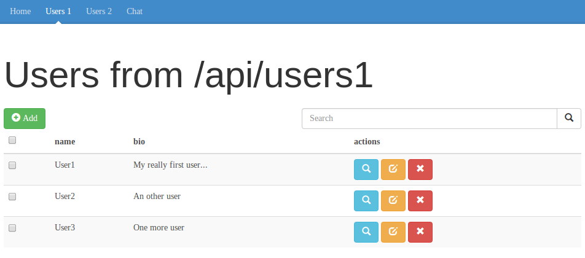
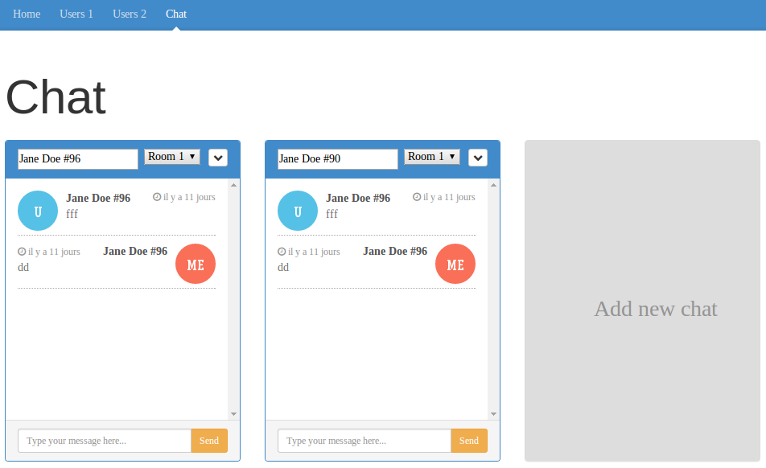

#### WORK IN PROGESS

# Play showcase

This project aims to show how to get started with Play / Scala and some nice features and boilerplate code.

It integrate several ways to use Play such as Standard Application (using Play templates) and Single Page Application (using AngularJS, Grunt and Bower).

## Used tools (and versions)

Before start using this project, you must install this tools :

- [MongoDB 2.4.8](https://www.mongodb.org/)
- [Scala 2.10.2](http://www.scala-lang.org/)
- [Play framework 2.2.3](http://www.playframework.com/)
- [nodejs 0.10.26](http://nodejs.org/) and npm 1.3.11
- [bower 1.3.3](http://bower.io/) (`sudo npm install -g bower`)
- [grunt-cli 0.1.13](http://gruntjs.com/) (`sudo npm install -g grunt-cli`)

Here is a list of used libraries (with their version) :

- [ReactiveMongo 0.10.0](http://reactivemongo.org/)
- [AngularJS 1.2.16](http://angularjs.org/)
- [Bootstrap 3.1.1](http://getbootstrap.com/)

Feel free to send a pull request to upgrade versions...  
_(I will try to stay as up to date as possible)_

## Run application

- Open a terminal and go to the root app folder
- Create the view folder for Play (`mkdir app/views`)
- Go to frontend folder to setup tools (`cd ui`)
- Install grunt dependencies (`npm install`)
- Install bower dependencies (`bower install`)
- Build front-end code (`grunt play`)
- Start MongoDB on your machine on port 27017 (default)
- Return to root folder (`cd ..`)
- Run play server (`play run`)
- Open application : [localhost:9000](http://localhost:9000/)

## Development

When you develop with this configuration, you should have at least two terminals opened. One to run Play  server (backend) and one for compiling frontend assets with grunt.

- Go to folder ui/ and run `grunt dev`. It will launch a watch to sync your frontend files in play.
- Go to root folder and run `play run`. It will start the play server.

## Screenshots

CRUD :

Chat :

## TODO

- write tests !!! (Scala & AngularJS)
- finalize scala rest apis (improve actual code, remove deprecated code)
- add a REST api with [play-autosource](https://github.com/mandubian/play-autosource)
- work with more complex objects (nested objects, arrays, options) & add metadata (createDate...)
- improve REST apis & UI (pagination, searches...)
- add global CRUD actions (delete all / delete selected...)
- add authentication and private views

## Credits

I take some code & inspiration in various projects and articles. Bests are :

- [Eventual activator](https://github.com/angyjoe/eventual) from Typesafe
- [Reactive app](https://github.com/sgodbillon/reactivemongo-demo-app) from Stephane Godbillon
- [JSON Coast-to-Coast Design](http://mandubian.com/2013/01/13/JSON-Coast-to-Coast/) from Mandubian
- [angular-play-mongo-sample](https://github.com/loicdescotte/angular-play-mongo-sample) from Loïc Descotte
- [SSE chat](https://github.com/matthiasn/sse-chat/) from Matthias Nehlsen
